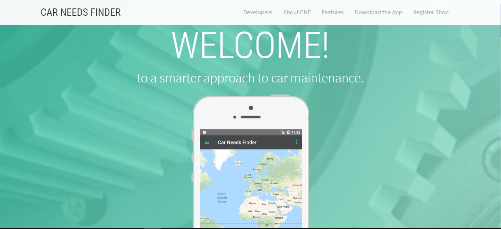
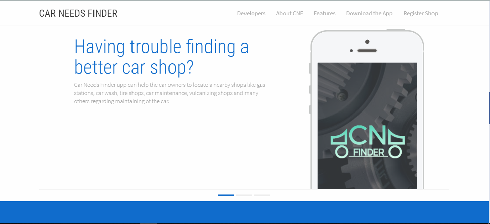
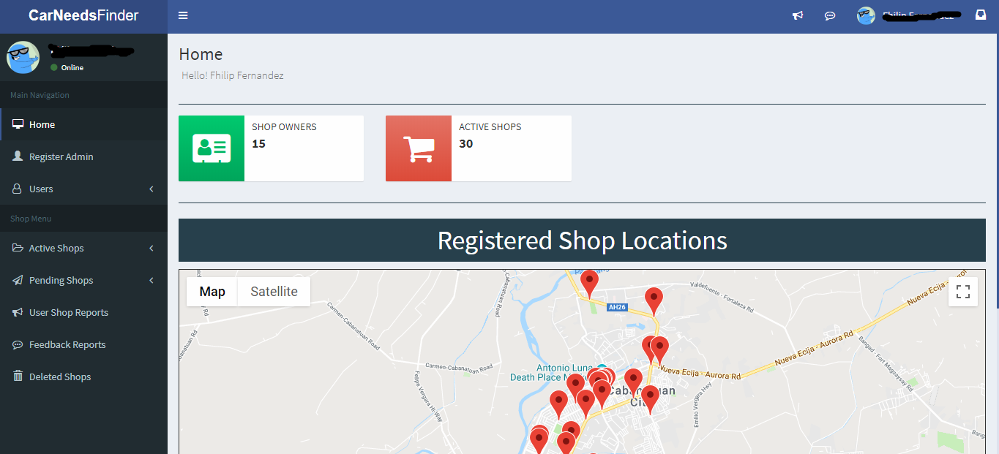
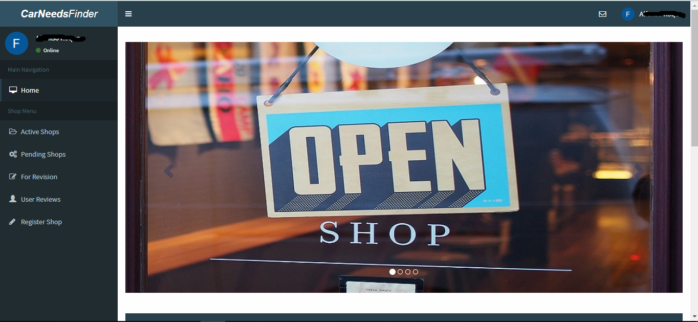
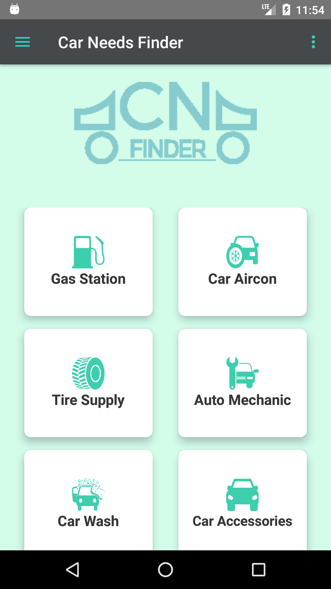
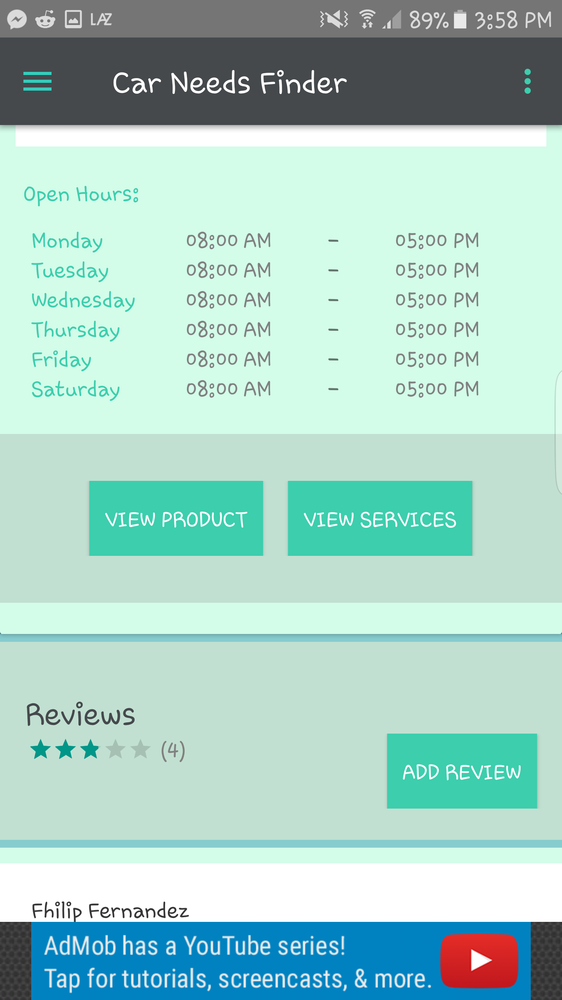
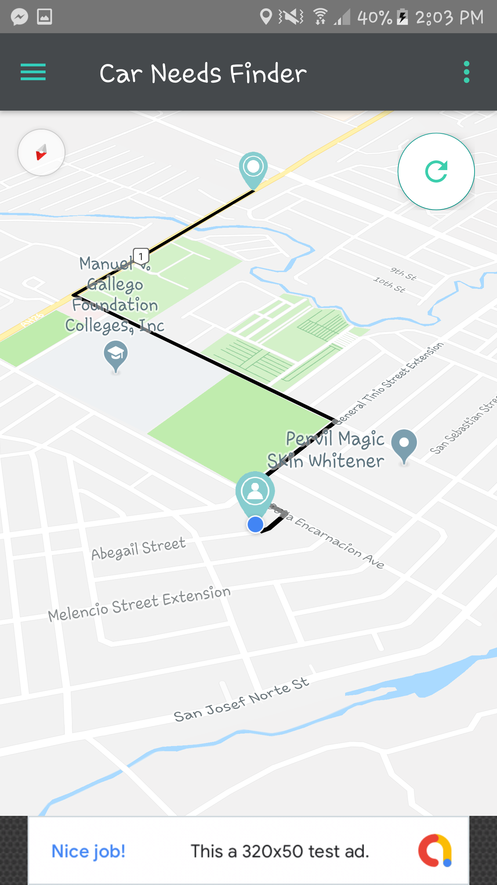
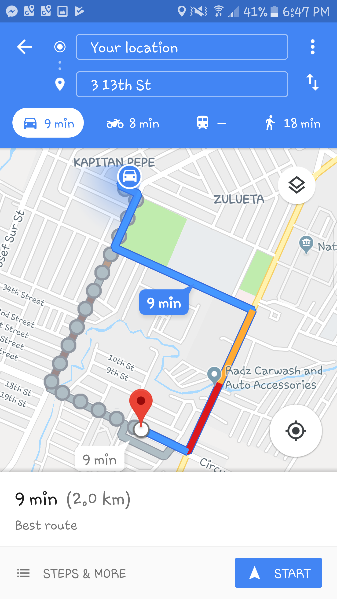

# CarNeedsFinder

  

<b>Car Needs Finder</b>

&nbsp;&nbsp;&nbsp;&nbsp;&nbsp;Car Needs Finder or CNF offers a comprehensive guide for car owners to quickly locate nearby shops for car services and upgrades. Rather than having to contact these shops individually, the app displays helpful ratings and review of the shops and the services they offer to guide a car owner in selecting the best one that can provide their needs. CNF covers varied car shops including car wash, gas stations, tire shops, car maintenance, car detailing shop and many others regarding maintaining and upgrading a car. In a nutshell, the app is a one-stop-shop for finding the perfect car shop that can fulfil one’s car upgrading and maintenance needs.
 
&nbsp;&nbsp;&nbsp;&nbsp;&nbsp;Furthermore, shop owners will be able to add their shop to the application by registering its information to the system using the web-based. It includes the shop name, address, location, image of the shop, type of shop and other information. Shop owners will have a convenient access to the web-based application because it is mobile friendly. 
 
&nbsp;&nbsp;&nbsp;&nbsp;&nbsp;Car needs finder can help the car owners to locate a nearby shops like gas stations, car wash, tire shops, car maintenance, vulcanizing shops and many others regarding maintaining of the car. They can also find a good quality services by searching the shop and its feedbacks. And it will also benefit the shop owners by helping them to be located their shop and find a new costumer
 
&nbsp;&nbsp;&nbsp;&nbsp;&nbsp; 
Used PHP as server scripting language and Android Studio for the application
 

<h1>Website</h1>
<h3>Home</h3>

  

  

<h3>Home Admin</h3>

  

<h3>Home Shop Owner</h3>

  

<h1>Android</h1>
<h3>Login Screen</h3>

  

<h3>Shop Category</h3>

  

<h3>Shop Details</h3>

  

  

<h3>Navigation</h3>

  

  

